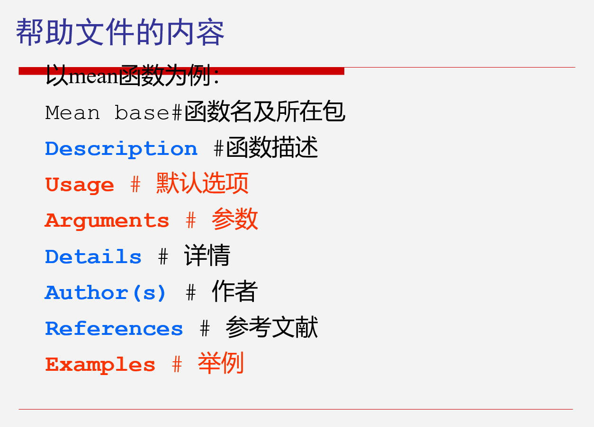
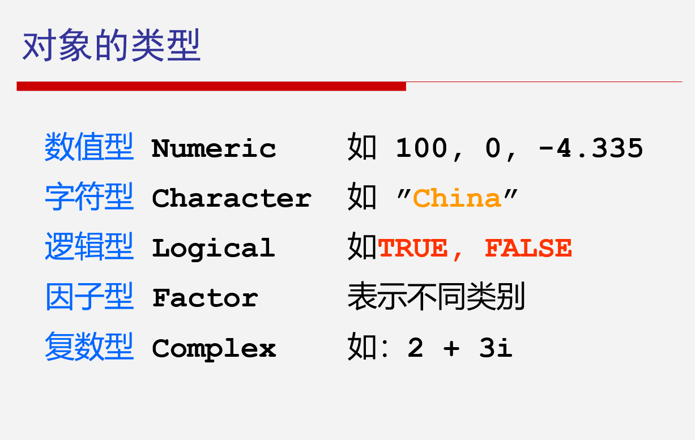
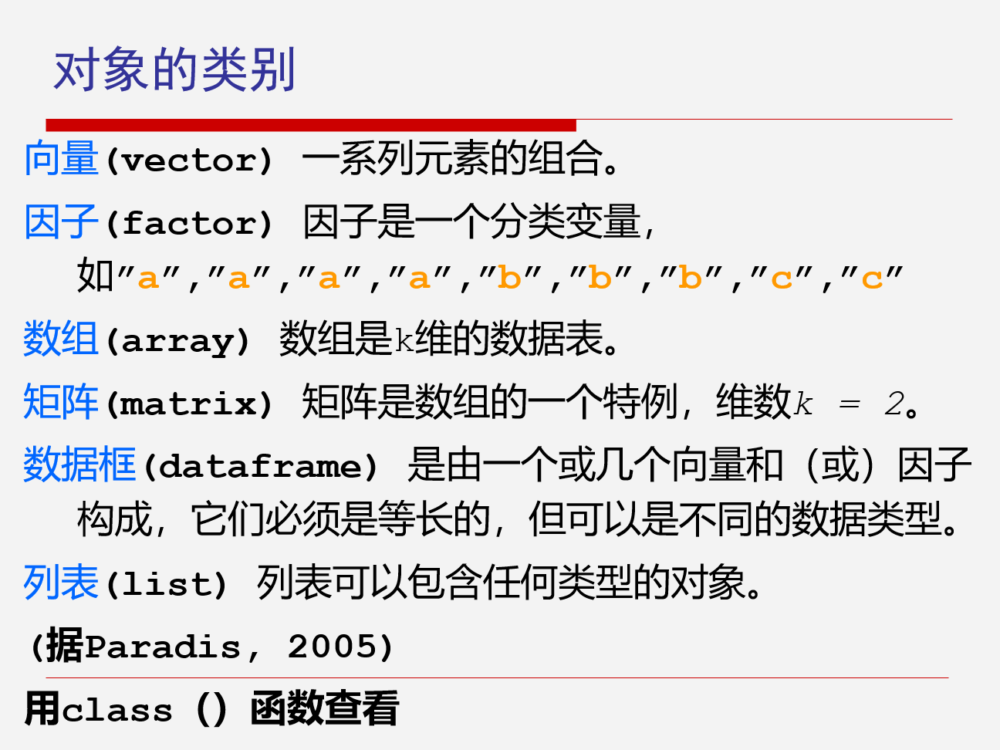
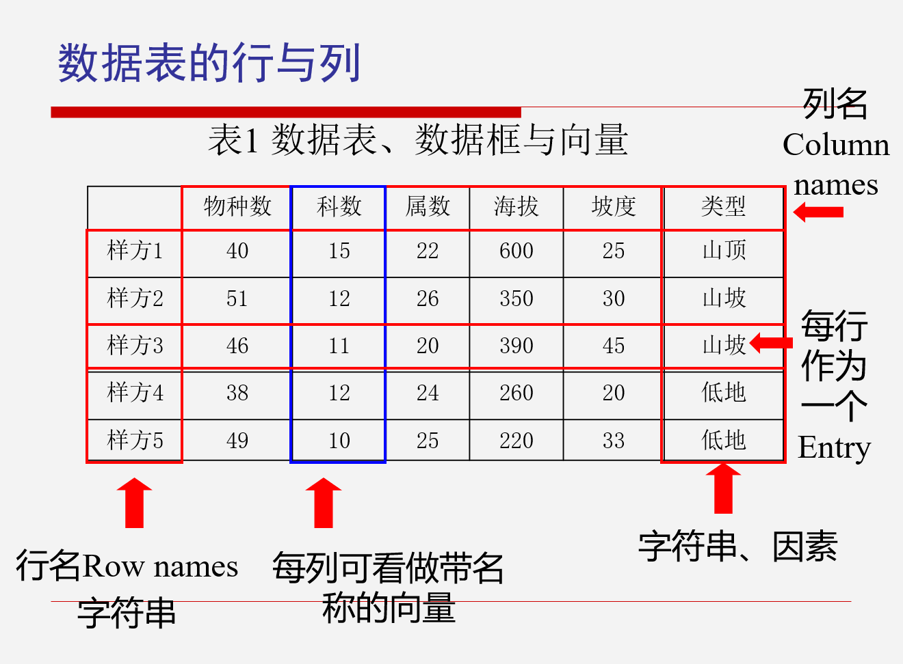
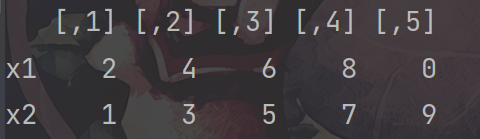
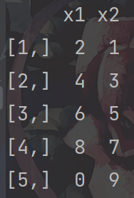

# 第一次课--R语言入门

期末考试安排：开卷，分析案例  
自S语言演变而来
***

### 　Ｒ作用

- 数据分析
    * 集中趋势指标
    * 变异性指标
- 数据挖掘
    * 数据挖掘是以查找隐藏在数据中的信息为目标的技术， 是应用算法从大型数据库中提取知识的过程， 这些算法确定信息项之间的隐性关联，并且向用户显示这些关联
    * 常见数据挖掘任务：关联分析，聚类分析，孤立点分析等等
    * 例：啤酒和尿布的故事
- 表现层
    * 报表
    * 图表

SAS一般用于自然分析，如医药等厂家或者超市分析顾客行为等等  
SPSS用于商业分析较多，有比较多的商业功能  
缺点：收费，特别贵
***

### 为什么用R

1. 免费，支持所有平台
2. 开源，有强大的工具包，可以贡献自己的工具包
3. 可以完成数据分析涉及的所有步骤

python处理序列效果很好，R处理数组和矩阵效果较好
***

### R的使用

library()：引用包  
<-：赋值

#### 帮助文件：



#### 对象：

  
  


#### rbind与cbind：

```r
x1 <- c(2, 4, 6, 8, 0)
x2 <- c(1, 3, 5, 7, 9)
print(x1[3])
bind1 <- rbind(x1, x2)
bind2 <- cbind(x1, x2)
print(bind1)
print(bind2)
q()
```

#### rbind效果：



#### cbind效果：



<u>**R语言向量起始数字是1不是0**</u>