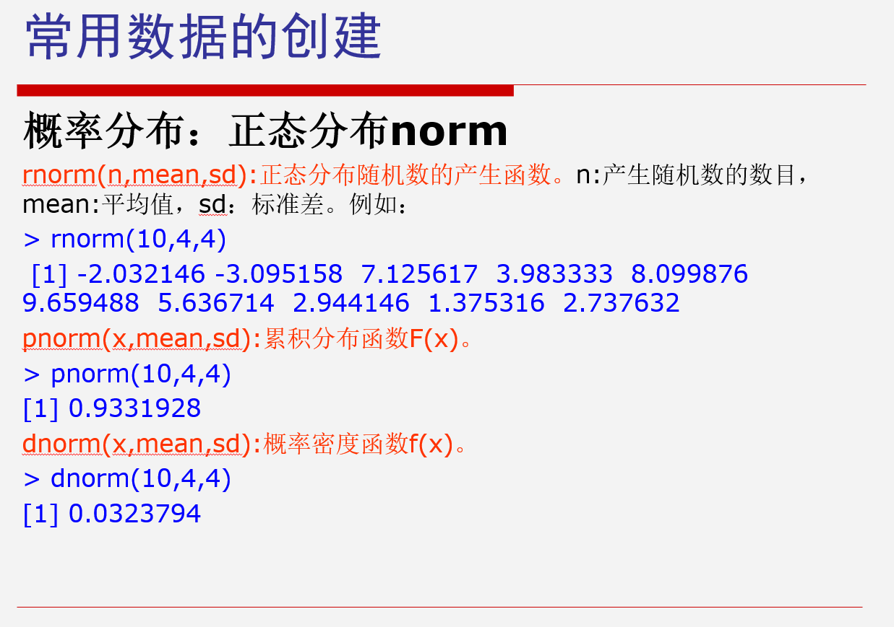
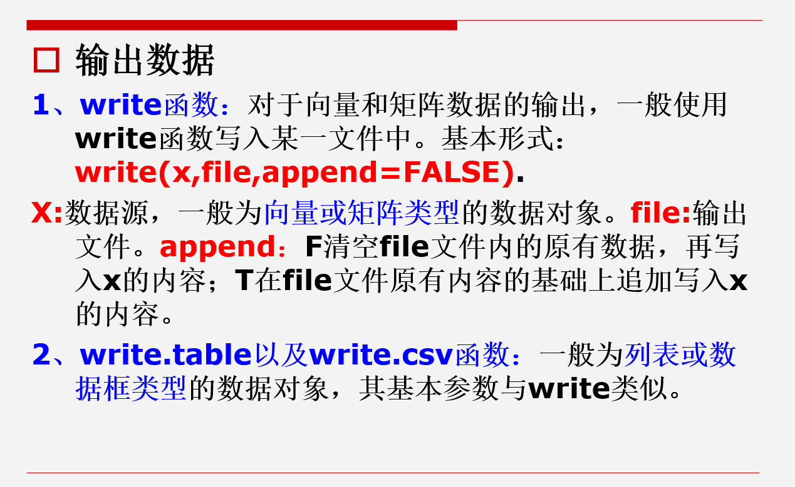

# 第三次课

***
分类属性类型可分为无序因子（factor）：  
如用户ID用“1”，“2”，“3”表示  
没有高低之分

有序因子（ordered）：  
如用户对商品的评分值“A”,”B”,”C”,”D”,”E”  
各个类别间存在大小高低顺序

```r
a1 <- c(1, 2, 3)
factor1 <- as.factor(a1)
print("无序因子：")
print(factor1)
ordered <- as.ordered(a1)
print("有序因子：")
print(ordered)
```

### 输出：

```
[1] "无序因子："
[1] 1 2 3
Levels: 1 2 3
[1] "有序因子："
[1] 1 2 3
Levels: 1 < 2 <3
```

***

### 常用数据的创建

因子序列创建 gl

```r
gl(3, 4, labels = c("one", "two", "three"))
```

```
[1] one   one   one   one   two   two   two   twothreethreethreethree
Levels:onetwothree
```

等差序列创建 seq

```r
seq(from = 1, to = 1, by = ((to - from) / (length.out - 1)))
```

```
length.out：产生向量的长度
```

随机抽样 sample

```r
sample(c(1:20), size = 10)
```

```
[1] 16  3  7  4  5 10  9  61120
```

重复序列 rep

```r
rep(1:3, 3)
```

```
[1] 1 2 3 1 2 3 1 23
```

概率分布：正态分布 norm  

***

### 数据的读写

```r
read.table() # 读取txt
read.csv() # 读取csv
scan() # 读取较大的文件速度会快一些，读文本数据到向量中
```

### 通过键盘输入数据

```r
对象名 <- scan()
```

### 输出数据



```r
# 具体写入函数
write.csv()
write.table()
...
```

