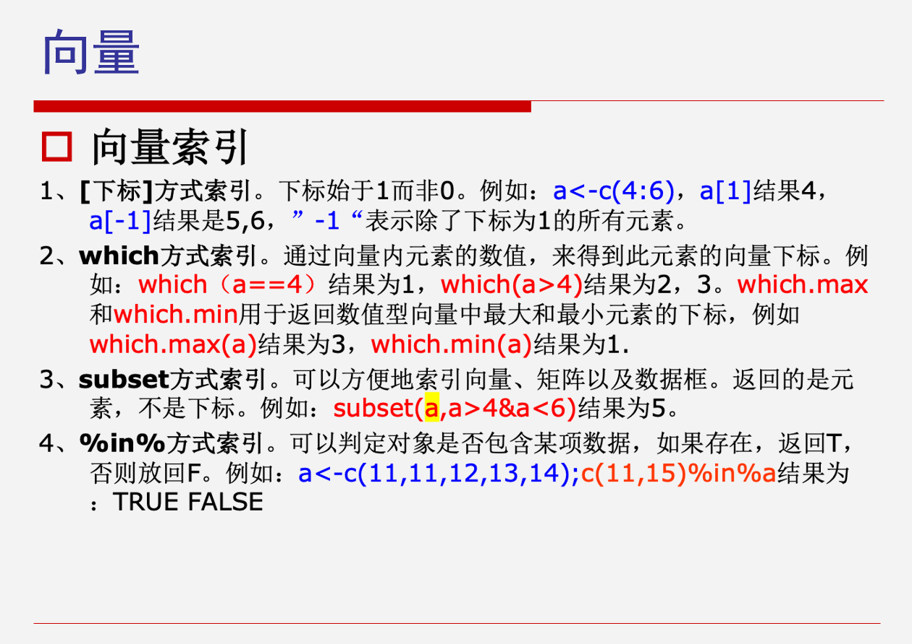
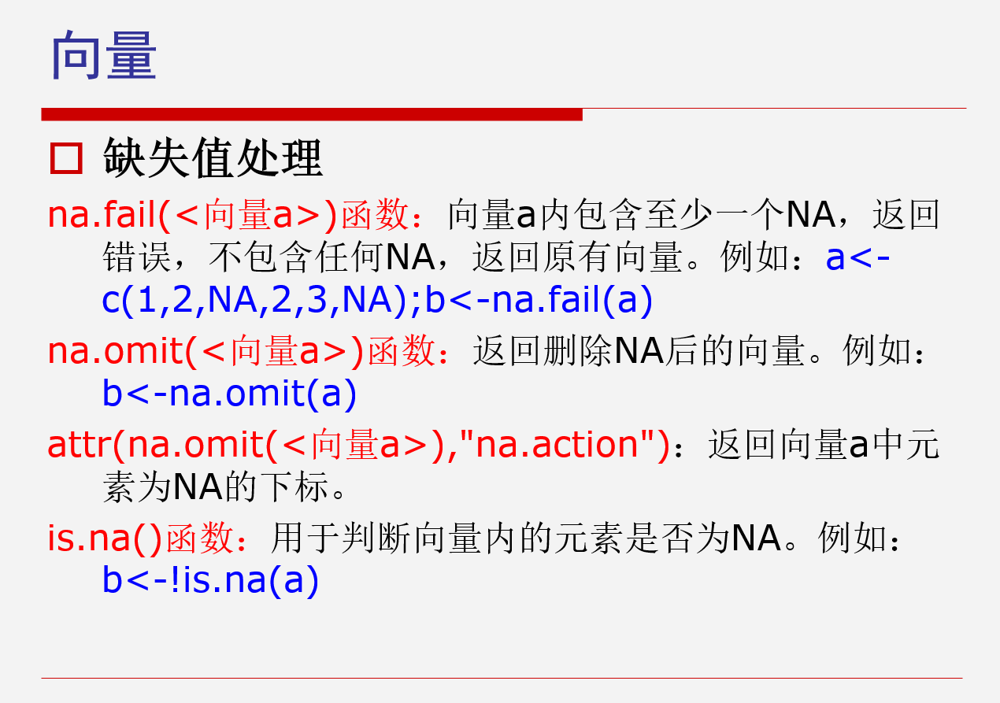
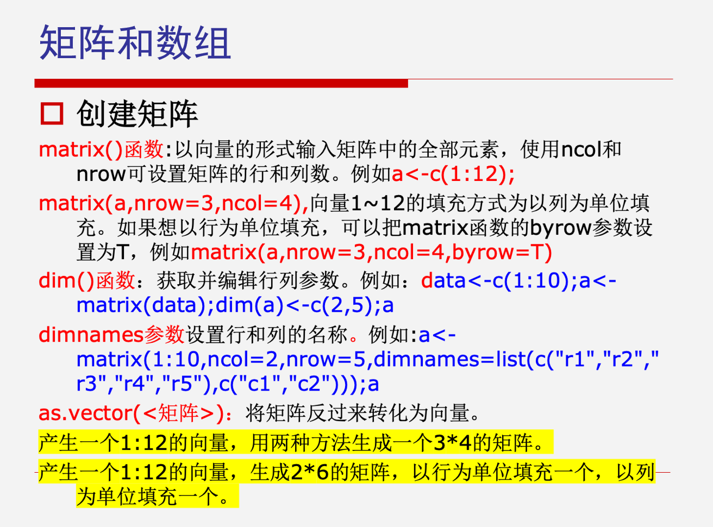
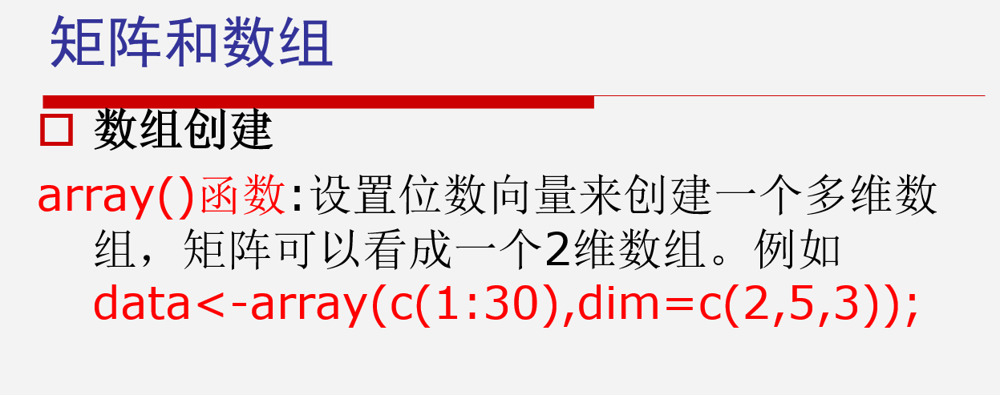
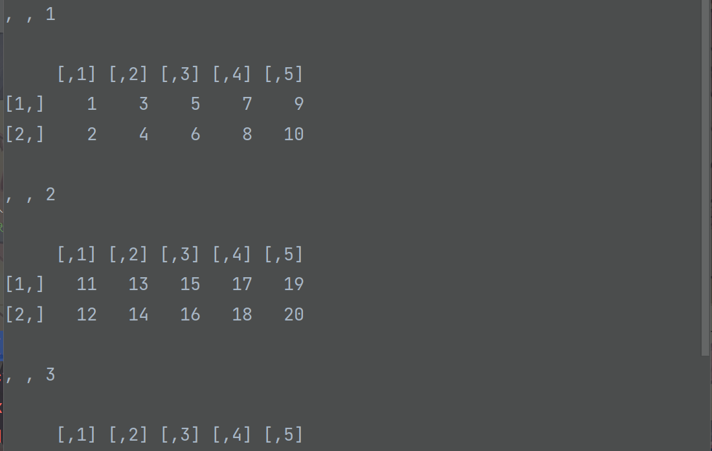
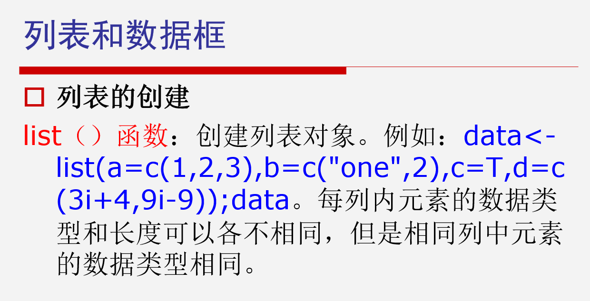
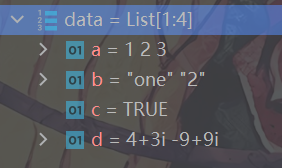
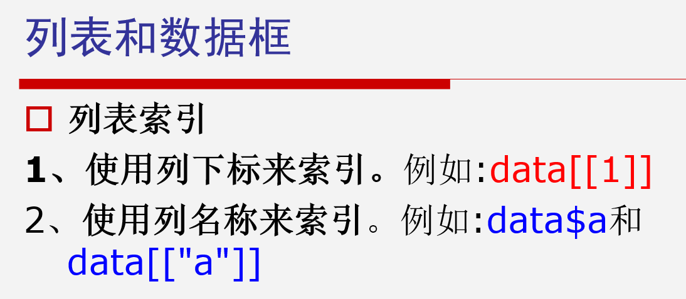
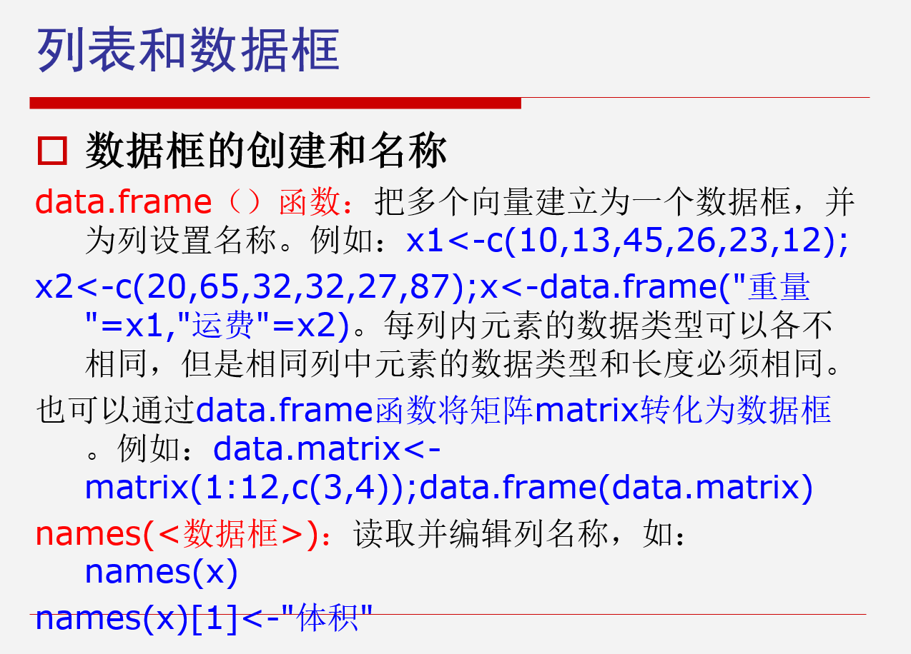
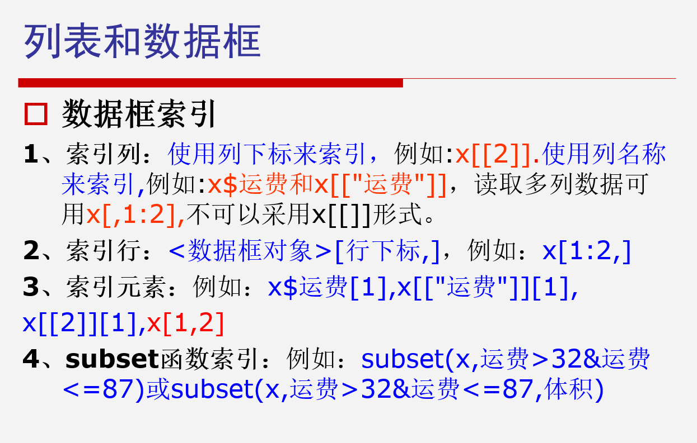

# 第二次课--R的对象
***
rep() 重复函数
```r
data4 <- rep(2:5, times = 4) # 重复函数
```
输出：  
```r
2 3 4 5 2 3 4 5 2 3 4 5 2 3 4 5
```
***
seq() 序列函数
```r
data5 <- seq(from = 3, to = 21, by = 3) # 序列函数
```
输出：  
```r
3 6 9 12 15 18 21
```
***
### 向量索引

```r
data1 <- data1[-1] # -表示去除第一个数
```
***
### 例题：产生一个1，2，5分别出现5，10，5次的向量
```r
data6 <- rep(c(1,2,5),times=c(5,10,5))
```
输出：  
```r
1 1 1 1 1 2 2 2 2 2 2 2 2 2 2 5 5 5 5 5
```
***
### 缺失值处理

***
### 矩阵塑形
```r
a <- c(1:12)
a <- matrix(a, nrow = 3, ncol = 4, byrow = T) # 生成矩阵3x4
dim(a) <- c(2, 6) # 矩阵重新塑形2x6
```

***
### 矩阵运算
- 矩阵的加法（A+B）
- 矩阵的减法（A-B）
- 矩阵的各元素的乘法（A*B）
- 矩阵相乘（A%*%C）
- 矩阵转置 t()  
例如：t(A)  
- 矩阵求解 solve()  
例如：求解DX=A中的X，可以使用solve(D,A)
- 矩阵的特征值和特征向量 eigen()  
例如：E<-eigen(D)  
***
### 数组创建

```r
data<-array(c(1:30),dim=c(2,5,3))
```
结果：

***
### 列表

```r
data<-list(a=c(1,2,3),b=c("one",2),c=T,d=c(3i+4,9i-9))
```

  

每列元素可以不同，但是列内元素必须相同


***
### 数据框


数据框列引用也可以 x[,2],就不用x[[2]]索引了
