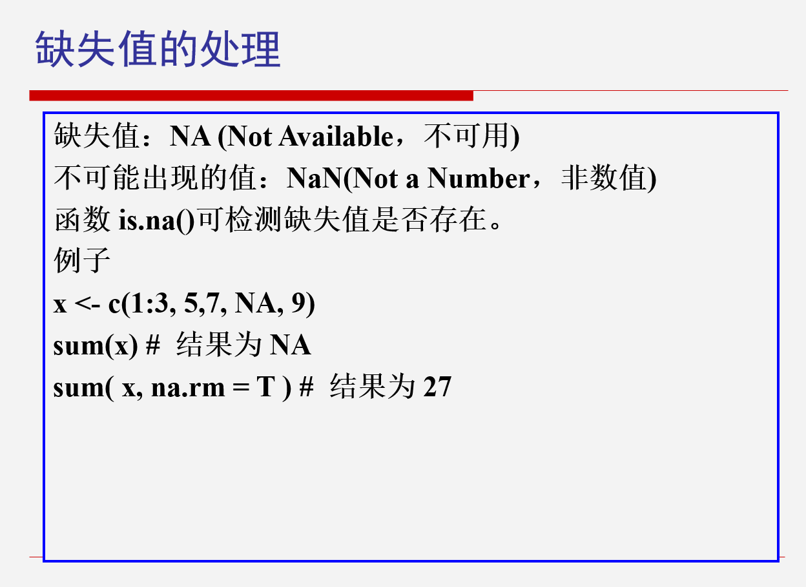
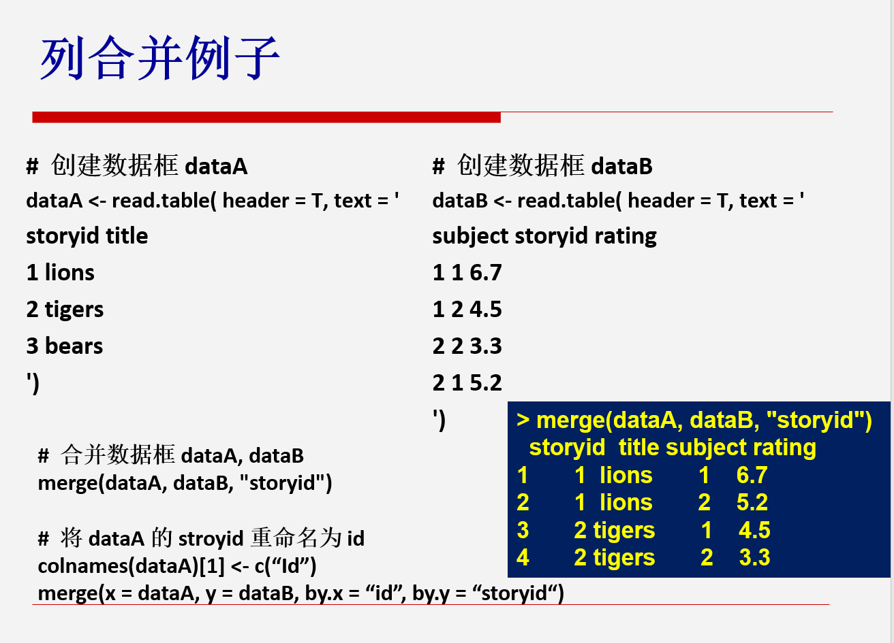

# 第五次课

***

### 变量的创建与删除

```r
# 创建dataframe
mydata <- data.frame(x1 = c(2, 2, 6, 4),
                     x2 = c(3, 4, 2, 8))
# dataframe添加列，列运算
mydata$sum <- mydata$x1 + mydata$x2
mydata$mean <- (mydata$x1 + mydata$x2) / 2
print(mydata)
# 方法二
mydata <- transform(mydata,
                    sum = x1 + x2,
                    mean = (x1 + x2) / 2)
```

#### 输出：

```r
#   x1 x2 sum mean
# 1  2  3   5  2.5
# 2  2  4   6  3.0
# 3  6  2   8  4.0
# 4  4  8  12  6.0
```

#### 变量删除（赋值为空）

```r
mydata$mean <- NULL
```

***

***


```r
# 合并用merge()函数
merge()
# 针对列名称不同时的合并
merge(x = dataA,
      y = dataB,
      by.x = "id",
      by.y = "storyid",
      all.y = TRUE)
# all.y是将y全列出来，如果x没有的话填上NA值
```

***

