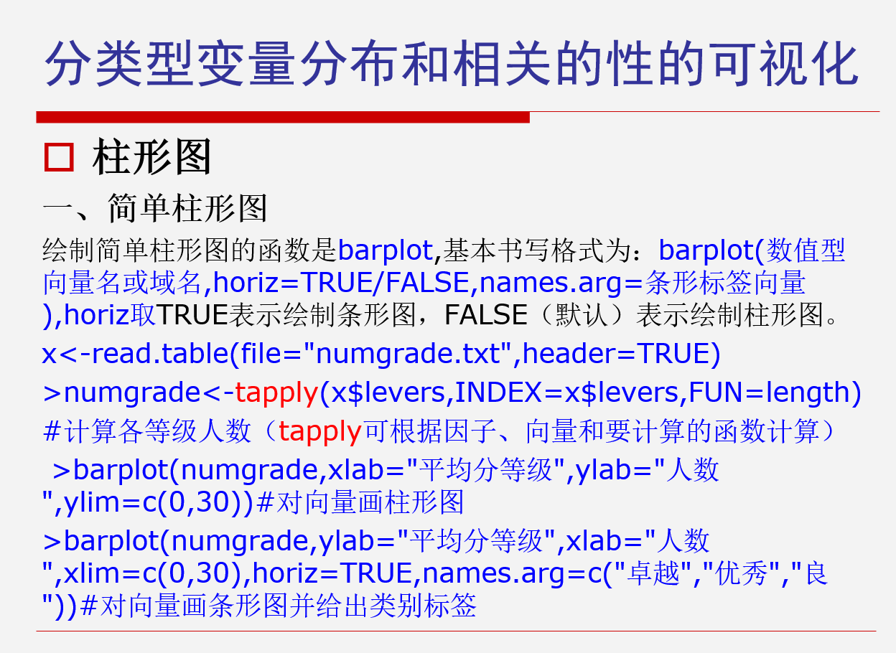
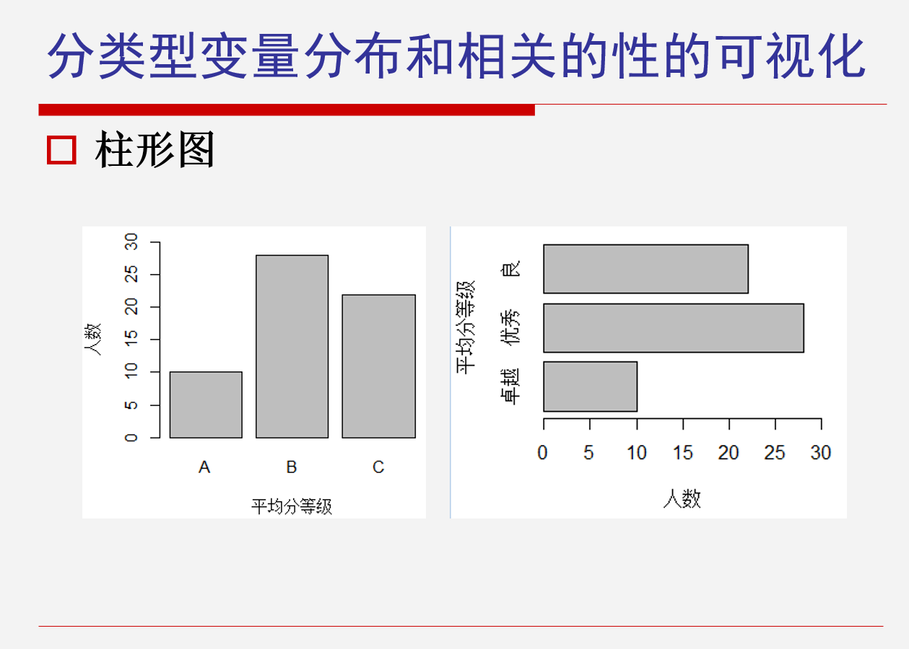
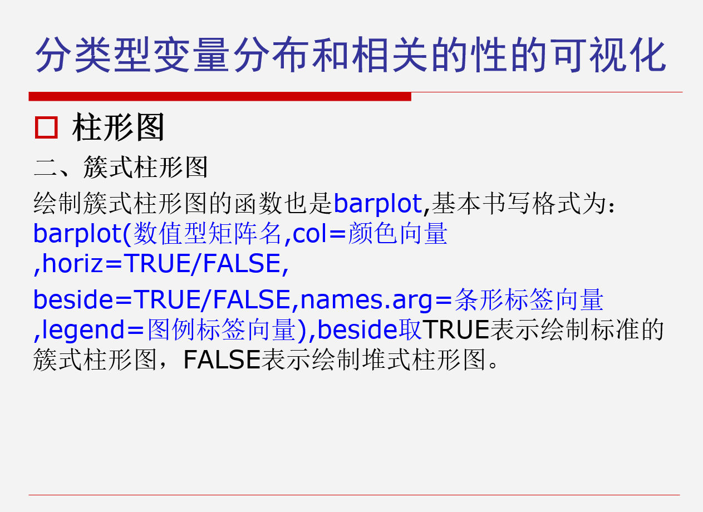
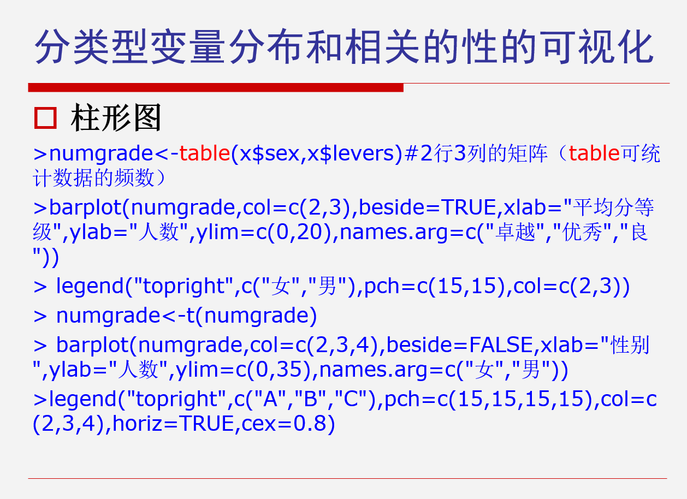
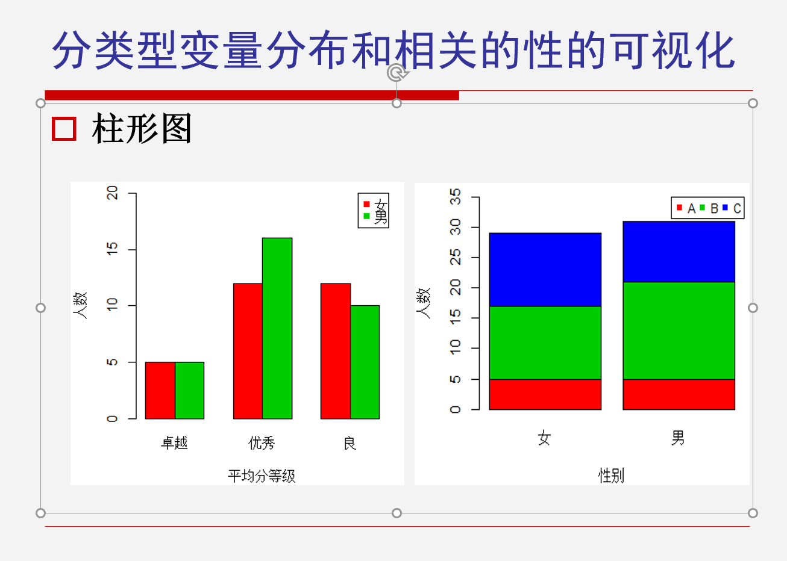
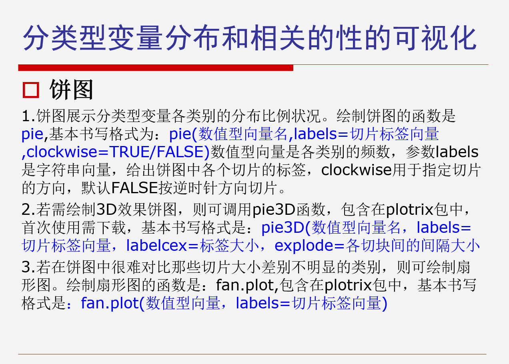
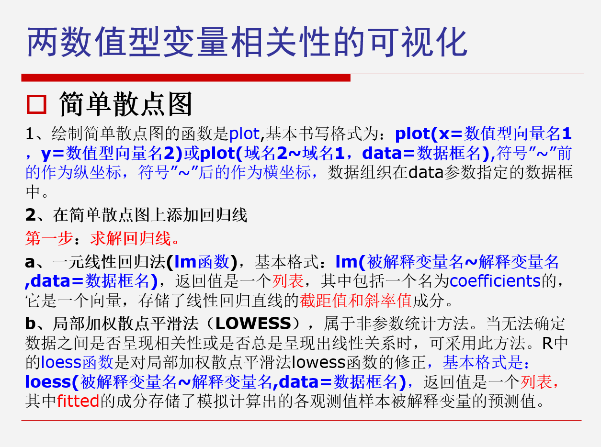
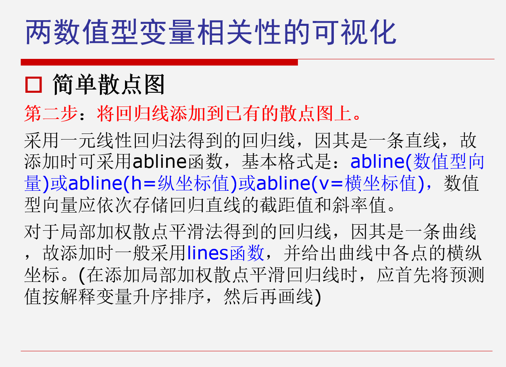

# 第六次课

***

### 柱形图







***

### 饼图


***

### 散点图




***

### 控制结构

#### 常见控制结构的命令：

- ```if and else```: 测试逻辑条件
- ```for```: 用于执行固定次数的循环
- ```while```: 用于在某个条件成立时执行循环
- ```repeat```: 执行无限循环
- ```break```: 终止并跳出循环
- ```next```: 跳过循环中的当前迭代
- ```return```: 从函数中退出

#### if控制结构

```r
if ( < condition1 >){
## do something
} else if(<condition2>){
## do something different
}else{
## do something different
}
```

#### for循环

- 第一种方法是将循环向量和向量x的长度相对应：

```r
x <- c("a", "b", "c", "d")
for (i in 1:4) {
  print(x[i])
}
```

- 第二个方法，使用```seq_along()```函数，即，输入一个向量，之后它就会创造一个与该向量等长的整数数列。因此上面的例子可以改写成，在我们不知道x的向量长度时，可以使用这种写法：

```r
x <- c("a", "b", "c", "d")
for (i in seq_along(x)) {
  print(x[i])
}
```

- 第三个方法，下标变量letter，这个变量的本意就是一个下标，会从向量本身取值，它可以从任意向量中提取元素，因此可以写成：

```r
x <- c("a", "b", "c", "d")
for (letters in x) {
  print(letters)
}
```

#### While 循环

```r
z <- 5
while (z >= 3 && z <= 10) {
  coin <- rbinom(1, 1, 0.5)
  if (coin == 1) {  ## random walk
    z <- z + 1
  } else {
    z <- z - 1
  }
}
```

#### repeat循环

这是一个无限循环结构，退出的方法是```break```（在某个点强制退出）。

注意，```repeat```循环风险很大，因为没硬性规定何时退出，有可能运行时间非常长，所以不建议直接使用

***

### 函数

```r
function_name <- function(arg_1, arg_2, ...) {
  # 函数体
}
```

函数返回值使用 ```return()```

#### 实例

```r
# 创建函数
new.function <- function(a, b, c) {
  result <- a * b + c
  print(result)
}

# 不带参数名
new.function(5, 3, 11)

# 带参数名
new.function(a = 11, b = 5, c = 3)
```


