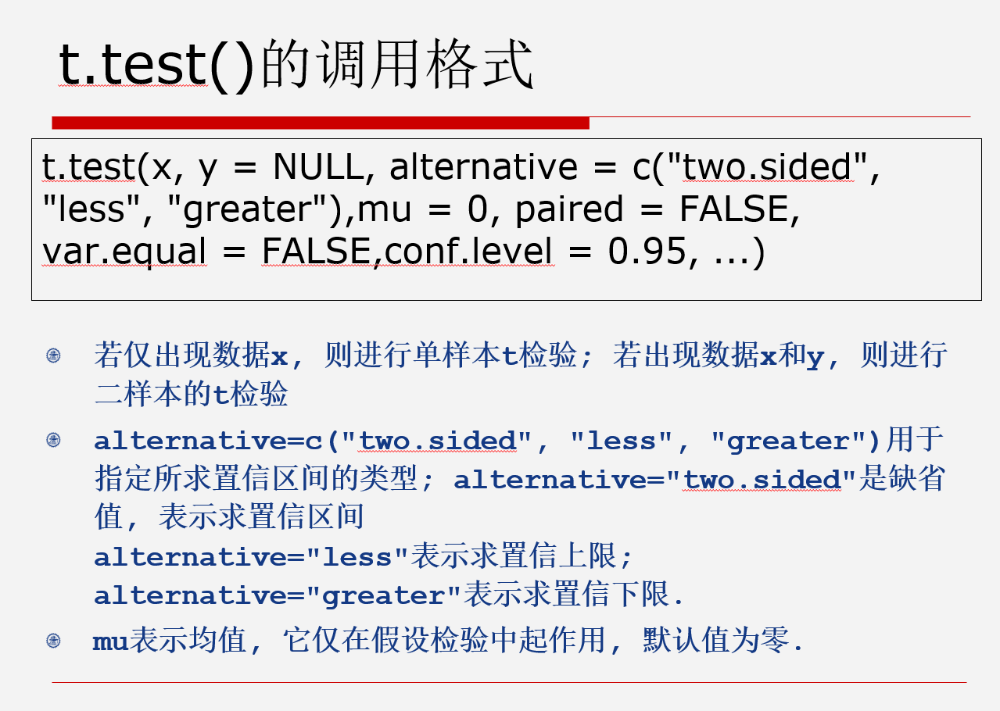
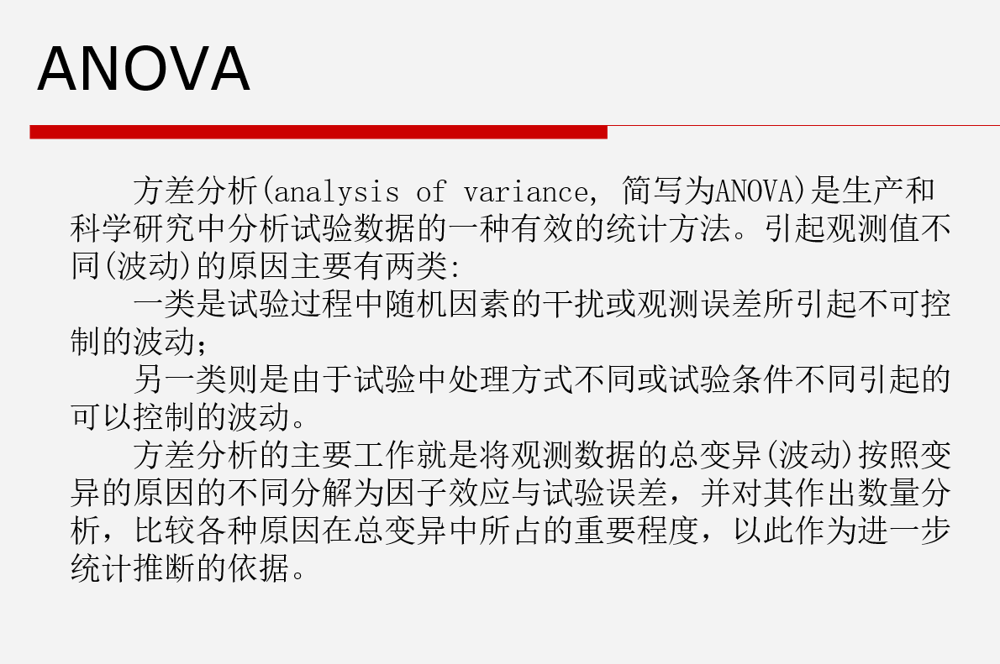

# 第四次课

***

### 脚本编写

脚本是一系列的命令  
可以先批量的编号程序，或者对别人已经编好的程序进行修改。 之后输入到控制台进行调试，以满足数据分析的需求。
***

### 假设检验和方差分析

P<0.05，差异显著，拒绝零假设，取备择假设

```r
t.test(x, y = NULL, alternative = c("two.sided", "less", "greater"), mu = 0, paired = FALSE, var.equal = FALSE, conf.level = 0.95, ...)
```



***

#### 不用alternative

H0:均值mu=64  
H1:均值mu不等于64

```r
samp <- c(53.56797, 60.12001, 59.857, 63.5358, 62.0039, 61.80454, 64.3353, 61.38428, 60.05831, 65.93938, 57.21961)
t.test(samp, mu = 64)
```

```
    OneSamplet-test

data:  samp
t = -3.0237, df = 10, p-value = 0.01281
alternative hypothesis: true mean is not equal to 64
95 percent confidence interval:
58.60396 63.18260
sample estimates:
meanofx
60.89328 
```

***

#### alternative="less"表示求置信上限，即mu<64

H0:均值mu=64  
H1:均值mu<64

```r
t.test(samp, mu = 64, alternative = "less")
```

```
    OneSamplet-test

data:  samp
t = -3.0237, df = 10, p-value = 0.006407
alternative hypothesis: true mean is less than 64
95percent confidence interval:
-Inf 62.75551
sample estimates:
meanofx
60.89328

```

结果拒绝零假设，接受备择假设，差异显著

***

#### alternative="greater"表示求置信下限，即mu>64

H0:均值mu=64  
H1:均值mu>64

```r
t.test(samp, mu = 64, alternative = "greater")
```

```
    OneSamplet-test

data:  samp
t = -3.0237, df = 10, p-value = 0.9936
alternative hypothesis: true mean is greater than 64
95percent confidence interval:
59.03106      Inf
sample estimates:
meanofx
60.89328

```

结果接受零假设，差异不显著

***

### ANOVA



```r
aov(formula, data = NULL, projections = FALSE, qr = TRUE, contrasts = NULL, ...)
# formula是方差分析的公式, 在单因素方差分析中它表示为x A, 
# data是数据框, 其它参见在线帮助
```

```r
# 单因子方差分析
X <- c(25.6, 22.2, 28.0, 29.8, 24.4, 30.0, 29.0, 27.5, 25.0, 27.7, 23.0, 32.2, 28.8, 28.0, 31.5, 25.9, 20.6, 21.2, 22.0, 21.2) #数据
A <- factor(rep(1:5, each = 4)) #分组
#输出 A=(1 1 1 1 2 2 2 2 3 3 3 3 ……5 5 5 5）
miscellany <- data.frame(X, A) #拼接
aov.mis <- aov(X ~ A, data = miscellany) #进行anova
summary(aov.mis)
plot(miscellany$X ~ miscellany$A)
```

```r
# 双因子方差分析
juice <- data.frame(
  X = c(0.05, 0.46, 0.12, 0.16, 0.84, 1.30, 0.08, 0.38, 0.4, 0.10, 0.92, 1.57, 0.11, 0.43, 0.05, 0.10, 0.94, 1.10, 0.11, 0.44, 0.08, 0.03, 0.93, 1.15),
  A = gl(4, 6),
  B = gl(6, 1, 24))
juice.aov <- aov(X ~ A + B, data = juice)
summary(juice.aov)
```

```r
# 有交互作用的方差分析
rats <- data.frame(
  Time = c(0.31, 0.45, 0.46, 0.43, 0.82, 1.10, 0.88, 0.72, 0.43, 0.45,
           0.63, 0.76, 0.45, 0.71, 0.66, 0.62, 0.38, 0.29, 0.40, 0.23,
           0.92, 0.61, 0.49, 1.24, 0.44, 0.35, 0.31, 0.40, 0.56, 1.02,
           0.71, 0.38, 0.22, 0.21, 0.18, 0.23, 0.30, 0.37, 0.38, 0.29,
           0.23, 0.25, 0.24, 0.22, 0.30, 0.36, 0.31, 0.33),
  Toxicant = gl(3, 16, 48, labels = c("I", "II", "III")),
  Cure = gl(4, 4, 48, labels = c("A", "B", "C", "D")))

rats.aov <- aov(Time ~ Toxicant * Cure, data = rats)
summary(rats.aov)
```